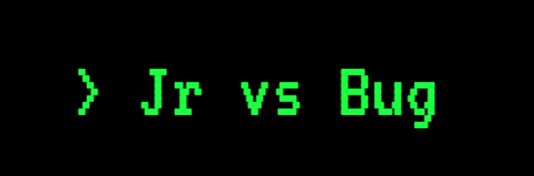
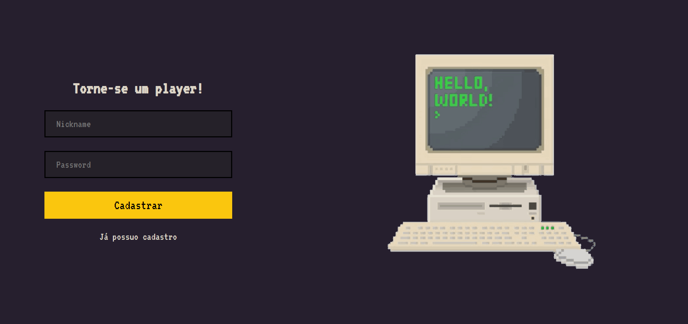
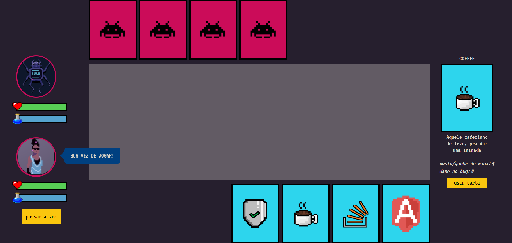

<p align="center">
  
</p>

# Sobre o projeto

Um simples game maneirinho de cartas por turno, com layout baseado em games 8 bit, pra bater aquela nostalgia :D

A premissa do game é que você é um desenvolvedor júnior e deu de cara com um bug. Como derrotá-lo? Escrevendo testes? Boas práticas? Chamar o Tech Lead pra dar aquele help? (☞ﾟヮﾟ)☞

Você pode se cadastrar como um player e daí é só jogar!

<div style="display: flex; align-items: center">


</div>

## Construído com:

- [React.js](https://pt-br.reactjs.org/) - Framework front-end

- [Typescript](https://www.typescriptlang.org/) - linguagem utilizada

- [styled-components](https://styled-components.com/) para estilização dos componentes

- [react-router](https://github.com/ReactTraining/react-router) para roteamento das páginas

- [prettier](https://prettier.io/), [eslint](https://eslint.org/) e [editorconfig](https://editorconfig.org/) para padronização do projeto

### Pré-requisitos

Para execução do projeto, é necessária a instalação do [Node](https://nodejs.org/en/) versão LTS e do [Yarn](https://yarnpkg.com/) em sua máquina.

### Instalação

Antes de executar o projeto, é necessário instalar todas as dependências executando:

```
yarn install
```

Executando o projeto:

```
yarn start
```

✔ Após executar o comando, poderá visualizá-lo em http://localhost:3000 em seu navegador.

🎨 Crédito das artes utilizadas: https://valenberg.tumblr.com/

Feito com ❤ por **Alessandra Moreira**
